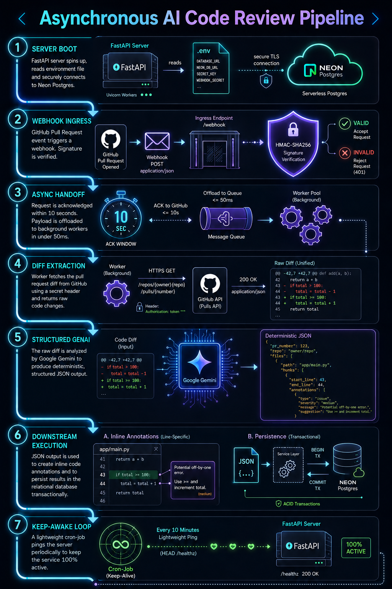

# 🤖 AI-Powered CodeReview Agent

An event-driven, asynchronous backend microservice that intercepts GitHub pull request webhooks, runs raw cryptographic verification, offloads processing under 50ms, and injects precise, AI-driven line-by-line code reviews straight into the developer's pull request interface.

---

## 🗺️ Architectural Pipeline

  

---

## ⚡ Core Technical Milestones

* 🛡️ **Cryptographic Verification:** Intercepts inbound raw byte streams via `HMAC-SHA256` signatures to shield LLM tokens from unauthorized exploitation.
* ⏳ **Asynchronous Ingress Execution:** Hands off incoming event data to independent `BackgroundTasks` pools under 50ms to strictly bypass GitHub's 10-second request timeout limit.
* 🔍 **Targeted Code Diff Parsing:** Utilizes customized headers (`application/vnd.github.v3.diff`) to stream *only* code alterations, minimizing analytical tokens.
* 🧱 **Structured AI Output Modeling:** Dictates deterministic schema formatting via `Pydantic` and enforces strict structural integer casting on code line counts to avoid upstream REST API `422` payload rejections.
* 💾 **State Resilience:** Implements isolated database sessions via `SQLAlchemy ORM` targeting a cloud-managed `Neon PostgreSQL` infrastructure with transactional rollback protections.

---

## 🛠️ Tech Stack & Ecosystem

- **Backend Context:** Python, FastAPI, Uvicorn, HTTPX Async Client
- **Artificial Intelligence:** Google Gemini AI SDK, Pydantic Data Models
- **Database Architecture:** Neon PostgreSQL Cloud, SQLAlchemy ORM
- **Security & Integrity:** Cryptographic HMAC-SHA256 Layer
- **Infrastructure Keep-Alive:** Cron-Job.org Scheduled Loops
